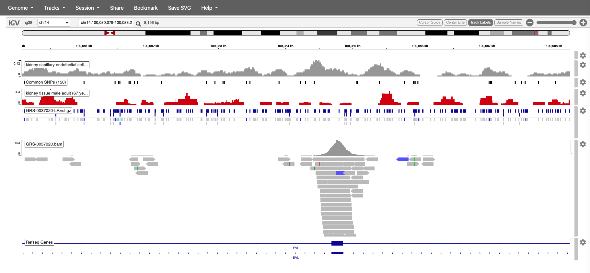

# Welcome to IGV WebApp Setup!

This branch is meant for setting up on EC2 standalone instance. To set it up on serverless, try using the main/master branch.
It demonstrates a CDK app with an instance of a stack (`ec2-igv-webapp-stack`) which contains an EC2 Instance which hosts the IGV WebApp.

This project is inspired by : https://github.com/igvteam/igv-webapp .

- Update the config.env as required.
- Deploy the Web App using below command.

```bash
sh deploy.sh <env>
sh deploy.sh dev/staging/prod
```

<br />
* Once deployed, the EC2 Private IP address can be used for going through the sequence viewer : http://EC2_PRIVATE_IP:8080 *

<br />
<br />

## Below is an example of how the files would look like in the App.


